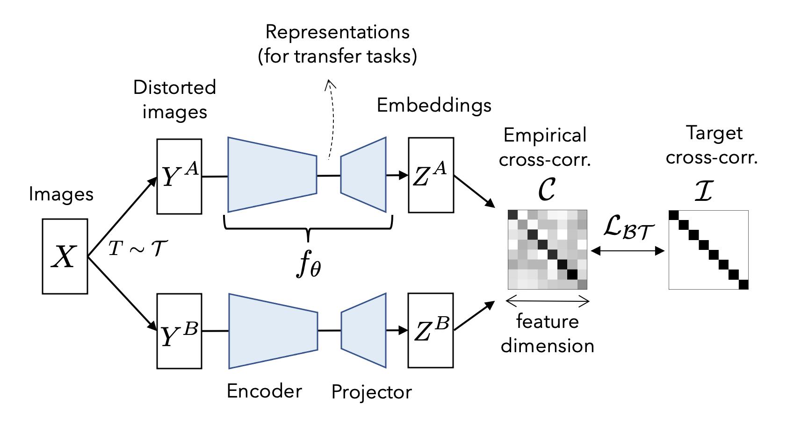
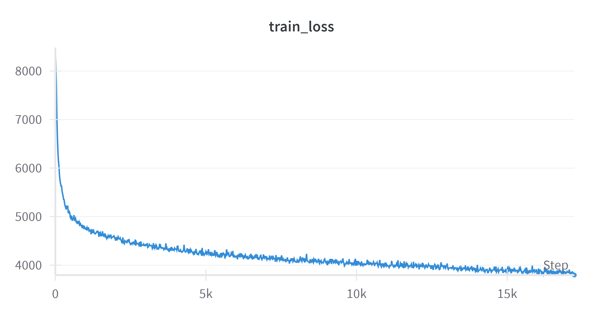
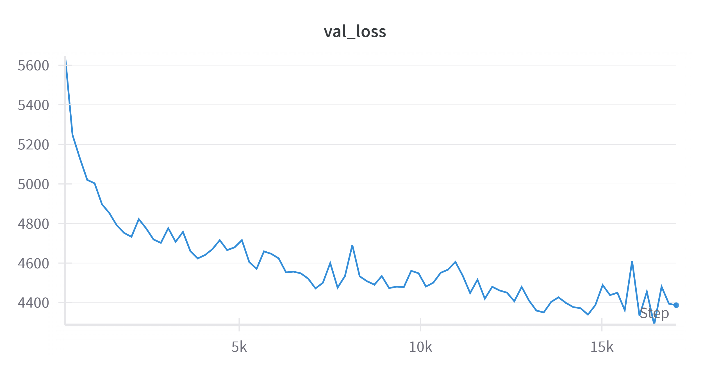
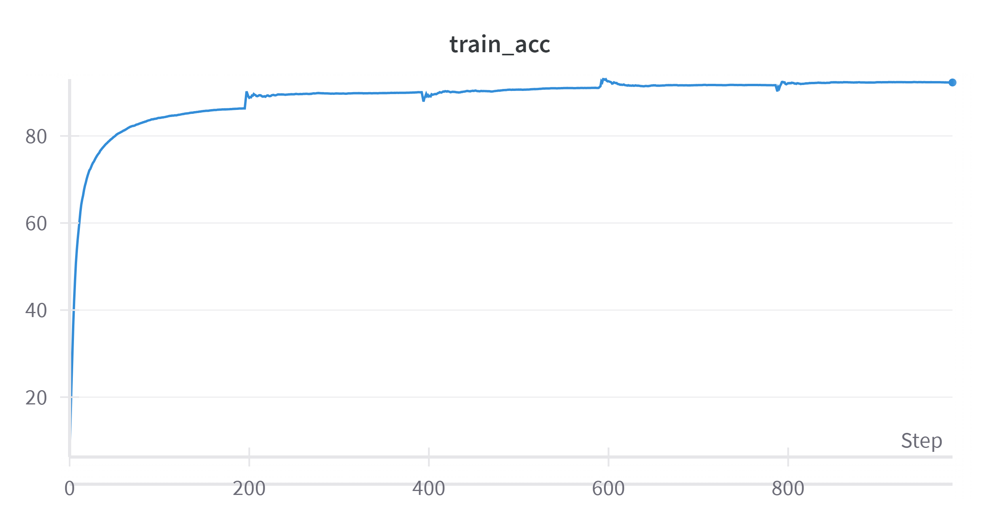
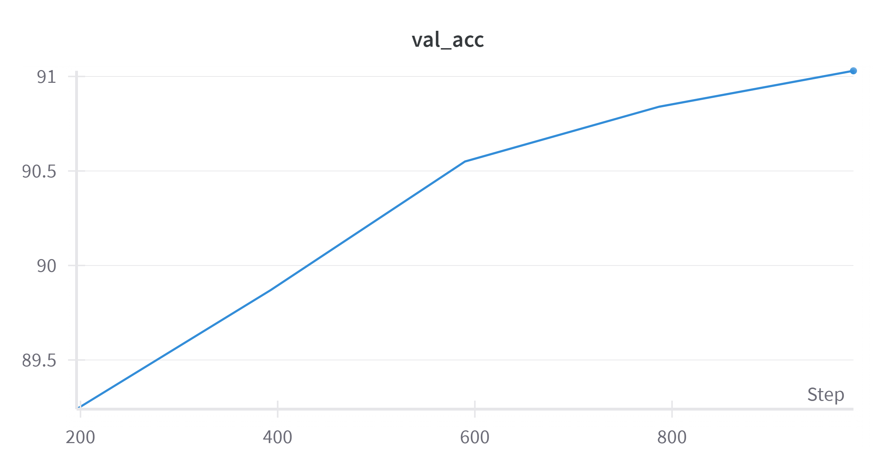

# Barlow Twins 
Pytorch-Implementation of barlow twins -[Barlow Twins: Self-Supervised Learning via Redundancy Reduction](https://arxiv.org/pdf/2103.03230)


<p align="center">
  
</p>


# Getting Started 
- First git clone this repo 
```bash 
git clone https://github.com/dame-cell/barlow-twins.git
```
- Download some dependencies
```bash 
cd barlow-twins 
pip install -r requirements.txt 
cd model 
```
- To train the model you can simply just run this command 
```
python3 train_model.py --batch_size 124 --checkpoint_dir "bt_model-part2" --epochs 500 --save_epoch 40 ```
```
- For the batch size it really depends on your hardware or GPUs ,if you are trying it on t4 try 124 anything better that t4 256 should do well.

- To evaluate the pre-trained encoder model ,first you need to download the pre-trained mdoel
```python
from huggingface_hub import hf_hub_download
hf_hub_download(repo_id="damerajee/barlow-twins-pt", filename="model.pt",local_dir="model")
```
- And then run this
```python
!python3 evalute.py --epochs 5 --batch_size 256 --path_to_encoder_model path to your downloaded  model
```
# Observations

We trained the Barlow Twins model for 85 epochs and used Weights & Biases (wandb) to track the train loss and validation loss.

| Train Loss | Validation Loss |
|:----------:|:---------------:|
|  |  |

- The train loss went from **8000** to **3795**.
- The validation loss went from **5000** to **4347**.

I only train the model on 88 epochs due to GPU limitations 

### Evaluation

We evaluated the model on the CIFAR-10 dataset in two stages:
1. Without the pre-trained encoder
2. With the pre-trained encoder

We evaluated each stage with only **5 epochs**.

| Metric                | Without Pre-trained Encoder | With Pre-trained Encoder |
|-----------------------|----------------------------|--------------------------|
| **Loss**              | 0.5079                     | 0.2193                   |
| **Accuracy**          | 82.31%                     | 92.28%                   |
| **Validation Loss**   | 1.1314                     | 0.2484                   |
| **Validation Accuracy**| 64.77%                     | 91.03%                   |

| Train Accuracy | Validation Accuracy |
|:--------------:|:-------------------:|
|  |  |

*The image above  shows the accuracy of the model with the pretrained-encoder.*

*really enjoyed this paper :)*
```bash
@article{zbontar2021barlow,
  title={Barlow Twins: Self-Supervised Learning via Redundancy Reduction},
  author={Zbontar, Jure and Jing, Li and Misra, Ishan and LeCun, Yann and Deny, St{\'e}phane},
  journal={arXiv preprint arXiv:2103.03230},
  year={2021}
}
```
